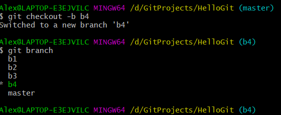

#### Git教程网站建议:[GIT官方介绍书籍](http://www.git-scm.com.cn/1511.html)

#### 准备

- 安装git

- 配置用户名和邮箱

  ```shell
  git config --global user.name "xxxx"
  git config --global user.email "xxxx@xx.com"
  ```

  

#### 开始前先了解下git里面4个区域的重要概念

1. 工作区(本地写代码的区域包括当前原版本的文件，或者新增的文件，或者修改过的文件，或者删除过的文件)
2. 暂存区(可以理解为一个缓存区，这个缓存区是待提交到本地版本库的地方，工作区的改动通过git add命令可以把改动放到这里，也可以从暂存区回退到工作区，通过git reset HEAD)
3. 本地版本库(暂存区通过git commit -m后生成的版本文件就会放到这里)
4. 远程代码库(本地版本可以push到远程库管理，远程也是个库，方便多人协作开发)

#### 1，git初始化

```shell
git init
```

###### 	让git对当前要进行版本控制的文件夹进行管理，进入对应的文件夹，例如我的是HelloGit文件夹，打开git终端，执行git init


#### 2，检测当前文件状态(必须记住，这个后续会频繁使用)

```shell
git status
```

###### 	查看当前git管理文件夹内所有文件的状态，例如：在HelloGit文件夹内新增test1.txt、test2.txt，然后执行git status命令


###### 	当前结果告诉我们，当前有两个新增的文件没有被当前git管理追踪到。

#### 3，把改动的文件加入到暂存区

```shell
git add 文件名
或者
git add .
```

###### 	把当前未被追踪到的文件信息（包括增、删、改），添加到暂存区，例如：把上面新增的test1.txt加入到缓存区，使用命令git add test1.txt，然后再次执行git status


###### 	结果发现添加到暂存区的test1.txt已经变成了绿色，并提示"Changes to be committed"（有改变待提交），而test2.txt依旧是红色的没有被追踪状态。接下来继续把test2.txt也加入暂存区进行管理追踪，可以继续使用**`git add test2.txt`**，但这样一个一个加比较繁琐，我们可以使用**`git add .`**进行把当前目录下所有未被追踪到的文件全部加到暂存区进行管理。最后用git status查看


###### 	这个时候，暂存区提示，有改变待提交的文件就有两个了。

#### 4，提交到本地版本库

```shell
git commit -m "注释..."
或者
git commit -a -m "注释..."	#这样会添加到暂存区和提交一并进行
```

###### 	使用git commit -m "注释..."会把当前暂存区所有待提交的文件一次性提交到本地版本库，提交完成后用git status查看


###### 	这个时候发现test1.txt和test2.txt已经提交到本地版本库了，git status发现暂存区也没有任何待提交的文件了。

#### 5，本地修改再提交

###### 	上面我们把test1.txt和test2.txt提交到本地版本库了，现在要对test1.txt进行内容更改，我们打开test1.txt然后随便修改点内容保存后，再使用git status看下


###### 	结果显示test1.txt当前的状态是modified(修改了)，而且Changes not staged for commit，就是说改变没有被暂存起来以便后续提交，当前的待提交改变为空no changes added to commit，所以我们再次使用`git add .`把当前所有的文件改变都暂存起来。


###### 	这个时候暂存区内提示待提交的改动就已经有test1.txt了并且也变成了绿色。我们可以再一次使用git commit -m "注释" 把test1.txt的改动提交到本地版本库。最后再用git status看下暂存区情况，发现已经没有东西了。


#### 6，查看版本库日志

```shell
git log 
或者
git log 文件名
```

###### 	使用命令git log可以查看当前提交的版本日志，例如：使用git log test2.txt，会把test2.txt的版本记录都例举出来，上面的操作你会发现我们就只有提交了test2.txt之后就没做过任何操作，而test1.txt我们是修改过内容，还提交到本地库，我们都看下各自文件的版本记录。


###### 	你会发现test2.txt只有一个版本记录，而test1.txt有两个，接下来我们再使用git log命令，这次不指定任何文件，这种情况下就会列举当前本地git库中所有的版本记录，通过上面可以看出git log这个命令列举出来的内容，和git log test1.txt列举出来的是一样的才对，因为test1.txt新增和test2.txt新增是同时提交的，他们存在一个相同的版本。


## 阶段小结

1. 进入需要进行版本管理的目录
2. git init进行初始化
3. git status检测当前目录文件的状态(检测暂存区的情况)
4. 三种状态的变化
   - 红色：新增的文件或者原来的文件进行了修改或者删除了源文件，可以使用`git add  文件名`或者`git add .`进行状态修改，红->绿
   - 绿色：git已经管理起来（已经放到暂存区了），但是还没有提交生成版本，需要使用`git commit -m "注释"`提交到本地版本库生成版本。
   - 生成版本

5. git log查看版本日志

#### 7，回滚

```shell
git log
git reset --hard 指定版本号
git reflog	#查看命令操作记录
```

###### 开发中经常会遇到提交错误的情况，这个时候我们往往需要进行版本回退，例如：我们上面对test1.txt进行内容的修改，并且把这个修改提交到了本地版本库，但是后面我们发现这个内容还没修复完成就提交了，我们希望把test1.txt回退到上一个版本，这个时候我们先使用git log看下版本记录情况


###### 找到了我们希望回退到的版本号，接下来使用git reset --hard 3418d3476dfa52ac371c7cbdedeb8562b5d3fdb5，进行回退


###### 最后我们使用git status和git log命令检查一下，发现确实是回退了，但是。。。但是，我们原本对test1.txt做的那些修改的版本哪去了呢？(git总不能把这给搞没了呀，毕竟我只是还没改完而已，我回退后还是需要这个版本接着写的)这个时候，使用git log已经找不到我们对test1.txt做的修改那个版本号了，要改为使用命令git reflog


###### 这个命令已经告诉我们，当前我们的最新版本HEAD已经切换到一开始"新增两个测试文件"的版本了（前面的版本号可以看出），这个时候我们如果反悔，我们想回到"test1.txt被修改了"版本，就可以使用`git reset --hard 4215f7f`即可。


#### 8，三大区域关系和互相切换


1. 工作区已控制文件过度到变更状态，git status可以自动检测，输出为红色则说明工作区中存在变动；
2. 工作区中的变动文件（上述红色），过度到暂存区（绿色），使用命令`git add 文件名`或者`git add .`;
3. 暂存区过度到本地版本库，使用命令`git commit -m "注释"`；
4. 版本库回到暂存区，使用命令`git reset --soft 版本号`；
5. 暂存区回到工作区中的变动（绿色回到红色），使用命令`git reset HEAD`;
6. 工作区中的变动回到原来版本控制的状态，即丢弃工作区的变动，使用命令`git checkout -- 文件名`(丢弃某个文件的工作区的变动回到最初控制状态)，或者使用命令`git checkout .`(把当前工作区目录的变动都丢弃回到最初控制状态，该命令很有可能导致工作区辛辛苦苦写的代码会化为乌有，慎用！！！)；
7. 版本库直接回到工作区的变更状态，使用命令`git reset --mix 版本号`；
8. 版本库直接回到原来啥也没改的状态，使用命令`git reset --hard 版本号`(同样的，该命令很有可能导致工作区辛辛苦苦写的代码会化为乌有，慎用！！！)；

#### 9，删除文件和移动（重命名）文件

```shell
git rm 文件名
git mv 原来文件名 新文件名
```

###### 使用`git rm 文件名`相当于做了两个操作，第一在工作区中删除了这个文件，第二把删除这个文件记录到暂存区；

使用`git mv 原来文件名 新文件名`相当于做了三个操作，第一在工作区中删除了原文件，第二新增一个新文件名的文件，第三把这次操作记录到暂存区；

#### 10，版本分支（非常重要！！！）

**以下命令都是基于本地版本进行操作**

```shell
git branch 分支名称		#创建分支(以当前版本库内容为基础建立一个分支)
git branch		#查看本地版本库当前存在哪些分支
git branch -v	#查看本地版本库当前存在哪些分支,并且附带每个分支最后一次的提交log
git branch -r	#查看远程库所有存在的分支
```

###### 这里我们新增b1，b2，b3分支方便后续测试，使用命令`git branch b1`，`git branch b2`，`git branch b3`，最后使用查看分支命令`git branch`，检查下当前本地版本存在的分支（注意这个时候git branch后面不需要加分支名称）


###### 这个时候可以看到当前存在b1，b2，b3，master分支，而HEAD分支（就是我们当前所在的分支），指向的是master分支，前面带有`*`

###### 切换分支

```shell
git checkout 分支名称	#切换分支
git checkout -b 分支名称	#创建分支同时切换分支(相当于'git branch 分支名称'和'git checkout 分支名称')
```



###### 现在新增了b4分支，同时HEAD分支也已经指向了b4

###### 接下来我们开始进入合并部分

```shell
git merge 要合并的分支名称		#合并某个分支的内容
```

###### 我们先模拟下两个场景（假设master是我们当前线上运行的版本），第一种情况：b4是要开发新功能的一个分支，第二种情况：bugfix是紧急修复bug版本分支。

###### 我们先和往常开发一样，切换到b4分支，并且开发新功能，提交新内容。假设往test2.txt文件种新增一些东西就当完成新功能开发。


###### 这个时候，线上突然发现一个bug，需要紧急修复，这个时候我们先要切回master（这个时候留意一下test2.txt的内容，当切换回到master分支后，工作区的内容会被全部同步为master的状态），并在master的基础上切一个分支bugfix出来，最后我们切换到bugfix分支。


###### 你会发现切换会master分支后，test2.txt恢复为一开始的空白状态了。


###### 接着我们就开始修bug，发现也是test2.txt引起的，我们迅速修复，并提交到bugfix分支


###### OK，至此我们已经修复了线上反馈的bug，但是当前还没有更新到线上的master分支，当前只不过提交到了bugfix分支而已，所以接下来我们要把bugfix分支的内容合并到master分支上，为此，我们先要切换回到master分支，然后使用git merge进行合并。


###### 这个时候我们再一次看下test2.txt的内容，发现已经同步过来了。


###### 好的，现在我们已经修复bug，也同步到master分支，可以发布到线上了。通过上面的log，你会发现master和bugfix都指向同一个版本节点了，这个时候我们其实已经不需要bugfix这个分支了，可以对其进行删除处理。在删除之前，我们可以使用命令查看当前分支有哪些分支已经合并过来了，或者哪些分支还没有被合并过来。

```shell
git branch --merge	#查看当前分支已经合并了哪些分支过来了
```


###### 你会发现bugfix已经出现在合并的列表上面，至于b1，b2，b3是一开始就切了一个分支过来那时候到现在没有做任何的改动，master自然而然也认为这三个分支也属于合并过来的了。但是唯独没有b4，因为我们已经在b4进行开发，有新内容提交了。我们可以用下面的命令验证下。

```shell
git branch --no-merge	#查看当前分支还没合并哪些分支
```


###### 上面就告诉了我们，当前mster分支还没有合并b4分支的内容。对于出现在`git branch --merge`结果列表上的分支，我们都可以使用一下命令进行删除。

```shell
git branch -d 分支名称		#删除本地的某个分支(前提是当前分支内容已被合并)
```

###### 例如：我们删除bugfix分支。


###### 但是，假如我们尝试下同样的命令去删除下b4分支


###### 它会提示出错，因为b4还有内容没有合并到当前master分支，如果你确定要删除，可以使用-D参数进行强制删除（慎用！！！）。

```shell
git branch -D 分支名称		#删除本地的某个分支(强制删除，不管分支内容是否已被合并，建议慎用！！！)
```

###### 好的，我们修复bug，合并bug内容，删除bug分支就到这里告一段落了。我们又重新回到b4的开发新功能分支，继续开发！我们之前已经提交了部分内容上去b4了，假如这个时候已经开发完成，这个时候我们要把b4的新功能合并到master分支，同样地，我们切换回到master分支使用合并命令`git merge b4`。


###### 但这个时候我们发现合并发生了点意外，上面的test2.txt合并时发生了冲突，提示要我们解决掉这个冲突后再提交。这个时候我们打开test2.txt内容看下


###### 上面的=======上半部分，为HEAD(当前就是master)的内容，下半部分为合并的b4的内容，因为他们都处于同一个修改地方，所以合并后存在了冲突，我们现在手动修复，两个都保留。然后提交


###### 最后查看下合并后的日志


###### 发现master已经合并b4的新功能，同时也保留了bugfix分支的修改。

#### 11，远程仓库

1. 注册GitHub
2. 新建仓库
3. 上传代码

##### 上传相关操作命令

```shell
#1，查看当前的远程分支
git remote
##如果想看下每个分子下自己当前的权限，可以使用-v参数
git remote -v
#2,给远程地址起个别名(只需要操作一次)，一般都叫origin，这样后续就可以把本地代码和origin对应的远程地址绑定了
git remote add origin 远程仓库地址
#3，给远程推送本地代码(-u可不用)
git push -u origin 分支名称
```

##### 下载相关操作命令

```shell
#1，克隆代码(一般第一次拉代码，内部已经实现git remote add origin 远程仓库地址)
git clone 远程仓库地址
#2，切换分支(克隆的时候会把远程的分支都拉下来，尽管我们本地用git branch发现不到)
git checkout 分支名称
#3，更新代码（拉取代码，这个命令等于git fetch和git merge）
git pull origin 分支名称
#4，这个也是拉去远程代码到本地版本库，但是不会进行merge，而上面的git pull则会自动进行merge，所以git fetch比较少用
git fetch 远程别名	#例如git fetch origin
```

#### 12，变基(rebase)

**作用1：合并提交记录**(不要合并已经push到远程的提交记录)

```shell
#合并从当前head到15f745b(commit id)
git rebase -i 15f745b
或:
#合并最近的三次提交
git rebase -i HEAD~3
```

###### 执行这个命令后，会跳到一个vi编辑器里面的提示有：
pick：保留该commit（缩写:p）
reword：保留该commit，但我需要修改该commit的注释（缩写:r）
edit：保留该commit, 但我要停下来修改该提交(不仅仅修改注释)（缩写:e）
squash：将该commit和前一个commit合并（缩写:s）
fixup：将该commit和前一个commit合并，但我不要保留该提交的注释信息（缩写:f）
exec：执行shell命令（缩写:x）
drop：我要丢弃该commit（缩写:d）

##### 实操一下：

###### 记录合并前


###### 现在希望合并HEAD最近的3条日志记录，执行命令`git rebase -i HEAD~3`，这个时候会弹出一个vi编辑器


###### 这里改成`squash`或者简写`s`，就是说我们希望把日志追加到前面的日志记录去，最后键入wq，保持退出。


###### 退出后来到这个窗口


###### 上面提示说，最终合并后的提交记录是这样的，但这样比较占空间，换了很多行，我们手动处理下，然后wq退出。


###### 最后用`git log`验证一下


###### 结果记录已经被合并。

